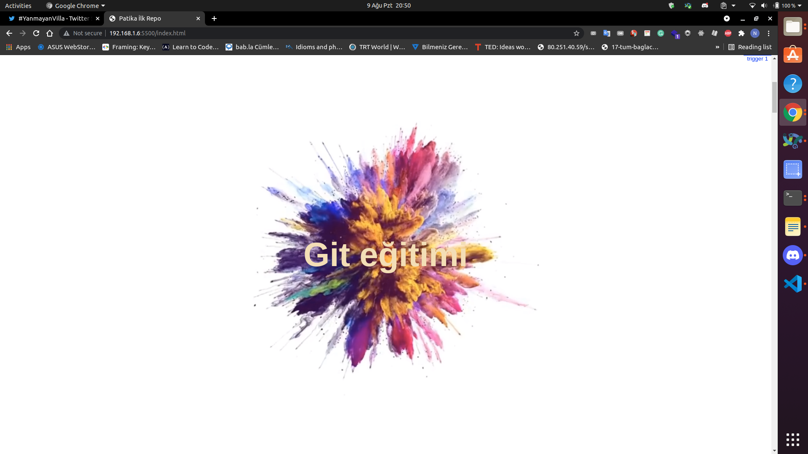

# Kodluyoruz Ilk Repo
Bu repo [Koduluyoruz](https://www.kodluyoruz.org/) Front-end egitiminde olusturdugumuz ilk repo. Içerisinde bir adet README dosyasi , bir adet de index.html barindiriyor.



# Installation
Öncelikle projeyi clonelayalim.

```
git clone https://github.com/FehmiCitiloglu/kodluyoruzilkrepo.git
```

# Usage
Projeyi cloneladiktan sonra Visual Studio Code programinda açiniz.


Linux için:

```
cd kodluyoruzilkrepo
code .
```

# Contributing
Pull requestler kabul edilir. Büyük degisiklikler için lütfen önce neyi degistirmek istediginizi tartismak için bir konu açiniz.

# License
[MIT](https://choosealicense.com/licenses/mit/)